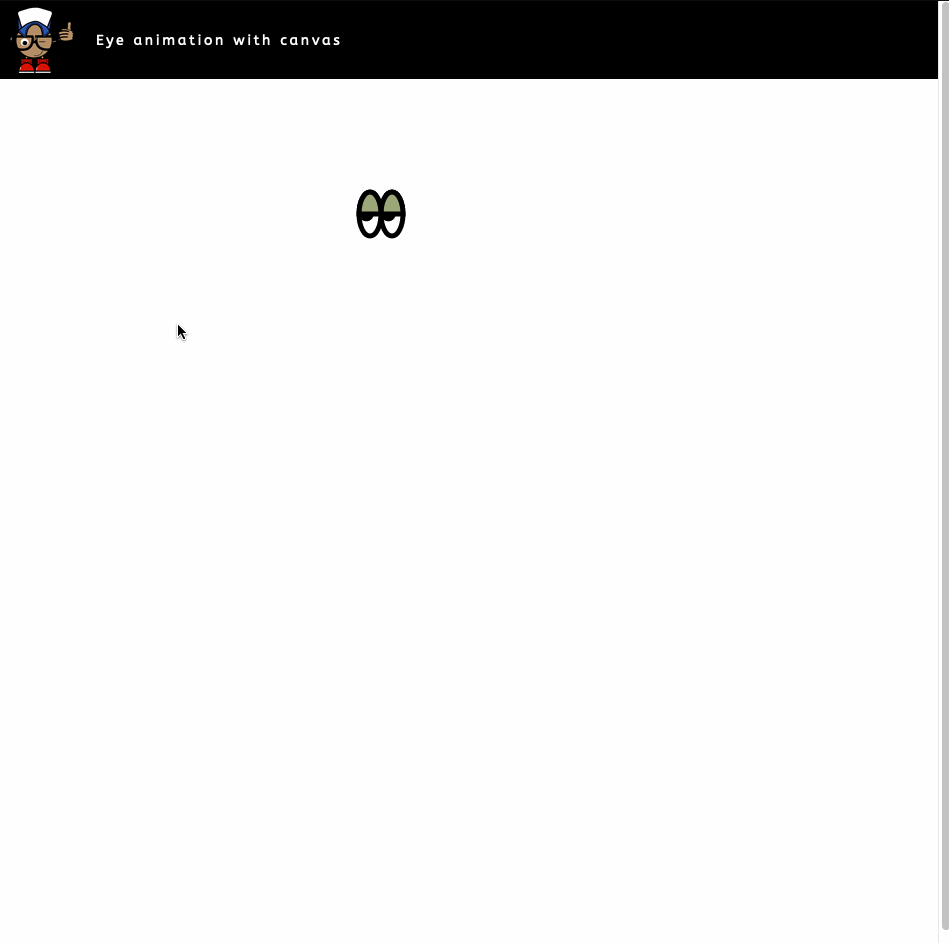
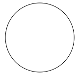
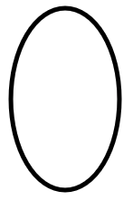
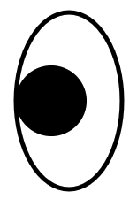
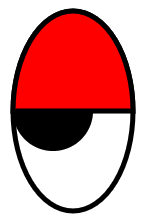
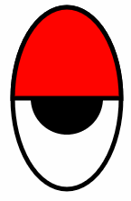

# Disapproving Eyes

The aim of this piece of work is to learn how best to create animations with canvas, using geometry to paint configurable shapes to the page.

## Prerequisites for running locally
- Docker compose
- Docker

## Running locally
- `./bin/install`
- open `index.html` in your browser

## The Result


## The Code
First of all we need to create a context on which to paint. Let's create a class which will handle all painting to the canvas. We can pass a HTML element into the constructor on which the canvas will be created.

```
   /**
    * Constructor
    *
    * @param {Object} element
    */
    let Painter = function (element) {
        // Create a context with a canvas.
        this.context = function () {
            var canvas = document.createElement('canvas');
            element.append(canvas);
            canvas.width = element.offsetWidth;
            canvas.height = element.offsetHeight;

            return canvas.getContext('2d');
        }();
    };
```
Now let's add a function to that class which will paint something to the canvas. The following will draw a  circle to the canvas. We can look at painting eyes to the canvas after.

```

   /** Paint an eye based on its current state.
    *
    * @param {Eye} eye
    */
    Painter.prototype.paintEye = function (eye) {
        // Paint a circle to the canvas.
        this.context.beginPath();
        this.context.arc(100, 75, 70, 0, 2 * Math.PI);
        this.context.stroke();

        // @todo: implement the painting of an eye
    }
```
We can invoke this like so:

```
    let painter = new Painter(document.getElementsByClassName("my-app")[0]);
    let eye = {};
    painter.paintEye(eye);
    
```
The following will be painted to the canvas:



So far, we are passing a HTML element with the class name "my-app" into the painter object. The context will be created in this element. We can then call the paintEye function on the painter, and that will draw a circle onto the canvas.

Okay, so we have a basic canvas set up on the page. Now we want to start looking at drawing the eyes. We want to make these configurable. The ways in which they vary are:
 
- Height
- Width
- Colour
- Position
- Frequency of the blinking

These will remain constant for any given eye. When animating the eyes, we will need to keep tabs on the following:

- The frame number of the eye animation
- The current position of the eyelid
- The current x position of the mouse which the eye should look towards

These properties will vary on each eye as the animation progresses. Lets see what the constructor looks like for our new Eye class. We are passing in the configuration for the Eye, and setting some initial values for the properties which will vary:

```
    /**
     * Constructor.
     *
     * @param {int} height
     * @param {int} width
     * @param {int} positionX
     * @param {int} positionY
     * @param {int} blinkInterval
     * @param {string} colour
     */
    let Eye = function (height, width, positionX, positionY, blinkInterval, colour) {
        this.height = height;
        this.width = width;
        this.positionX = positionX;
        this.positionY = positionY;
        this.blinkInterval = blinkInterval;
        this.colour = colour;
        this.frameNumber = 0;
        this.animationInMotion = false;
        this.animatingDownwards = true;
        this.eyelidOffset = 0;
        this.mouseX = 0;
    };
```

Now let's update the painter so that we can paint an eye in it's current state. This is where it gets a little more Mathsy. Now we need to use some geometry.

Lets start by configuring the canvas painting tools

```
    this.context.lineWidth = 5;
    this.context.strokeStyle = "black";
    this.context.fillStyle = "white";
   
```

We can start by drawing the outline of the eye. The function for trawing an ellipse with canvas is:

```
    void ctx.ellipse(x, y, radiusX, radiusY, rotation, startAngle, endAngle [, anticlockwise]);
```

- The X position is self-explanatory
- The y position takes into consideration the fact that the top of the canvas isn't actually at the top of the page.
- The width is self-explanatory
- The height is self-explanatory
- 2 * PI is 360 degrees in radians. So the last 3 parameters we pass in cause an ellipse to be drawn, using a full 360 degree rotation, starting from a point at 0 degrees, and ending back at that point (360 degrees)

```
    this.context.beginPath();
    this.context.ellipse(
        eye.positionX,
        eye.positionY - this.context.canvas.offsetTop,
        eye.width,
        eye.height,
        2 * Math.PI,
        0,
        2 * Math.PI
    );

    this.context.fill();
    this.context.closePath();
    this.context.stroke();

```

To test this we can invoke it like so:

```
        let painter = new Painter(document.getElementsByClassName("my-app")[0]);
        let eye = new Eye(
            100,      // height
            60,       // width
            100,      // position X
            150,      // position Y
            400,      // interval between blinks
            '#ff0000' // Color
        );

        painter.paintEye(eye);

```

The following will be painted to the canvas:



Now we draw the pupil.

- The pupil radius is a fraction of the eye radius - this helps us dynamically calculate the size of the pupil of a given eye size.
- We begin by determining whether the mouse is left of the eye's x position, and by how much.
- If the mouse is inside the eye, we can simply set the x position of the pupil to the x position of the mouse. However, if the mouse is outside of the eye, we wish to bound the eye, which will mean the outside of the pupil will be touching the outside of the eye. Once we know the x position of the pupil, painting it is simple enough.

```
    // Calculate pupil dimensions.
    let pupilRadius = eye.width / 1.5,
        mouseFromEyeX = eye.mouseX - eye.positionX,
        mouseLeftOfEye = Math.sign(mouseFromEyeX) === -1,
        absMouseFromEyeX = Math.abs(mouseFromEyeX),
        pupilXPosition;

    // Calculate x position of pupil
    if (mouseLeftOfEye && absMouseFromEyeX + pupilRadius > eye.width) {
        // If mouse position is outside left of the eye.
        pupilXPosition = eye.positionX - (eye.width - pupilRadius);
    } else if (!mouseLeftOfEye && absMouseFromEyeX + pupilRadius > eye.width) {
        // If mouse position is outside right of the eye.
        pupilXPosition = eye.positionX + (eye.width - pupilRadius);
    } else {
        // If mouse position is inside of the eye.
        pupilXPosition = eye.mouseX;
    }

    // Paint pupil.
    this.context.beginPath();
    this.context.arc(pupilXPosition, eye.positionY - this.context.canvas.offsetTop, pupilRadius, 0, 2 * Math.PI);
    this.context.fillStyle = "black";
    this.context.fill();
    this.context.closePath();

```    

The following will be painted to the canvas:



 Now to paint the eyelid. We start by setting up the fill style to the eyelid colour which was set inside the constructor of they eye. Now we use the same to draw the ellipse as we did for the eye outline. However, instead of beginning the ellipse at 0 degrees and ending it at 360 degrees, we wish to start on the left of the eye, and end on the right of the eye. This will create the incomplete ellipse which will form our eyelid.

- The position X and Y are self-explanatory
- The width and height are self-explanatory
-  We only wish to rotate half way around the ellipse, so 180 degrees (or Pi) will do
- When the offset is zero, i.e. the eye is as open as can be (half open), we wish to start at 0 (remember, this is measured from the x axis), and finish at 180 degrees (2 * Pi). As the eye closes, and the offset increases, we wish to move the the starting position down by the offset, and move the finishing position down by the offset also.

```
    // Paint eyelid.
    this.context.fillStyle = eye.colour;
    this.context.beginPath();
    this.context.ellipse(
        eye.positionX,
        eye.positionY - this.context.canvas.offsetTop,
        eye.width,
        eye.height,
        Math.PI,
        eye.eyelidOffset,
        Math.PI - eye.eyelidOffset,
        false
    );
    this.context.fill();
    this.context.closePath();
    this.context.stroke();

```

The following will be painted to the canvas:


 
Now for the exciting bit - the animation. In order to create an animation, we need to re-paint the canvas every frame. In order to achieve this we must first create a way in which we can clear the canvas between frames

Let's add a clear function to the painter class:

```
    /**
     * Clear canvas.
     */
     Painter.prototype.clear = function () {
        this.context.clearRect(0, 0, this.context.canvas.width, this.context.canvas.height);
    };

```

Now for the animation. We can use setInterval to call the function periodically.

```
    setInterval(function() {
        // This function first clears canvas
        painter.clear();

        // We wish for the eye to remain open for a short period of time between blinks. If this period has passed, we
        //mark the eye as animating downwards appropriately.
        if (eye.frameNumber === eye.blinkInterval) {
                eye.animationInMotion = true;
                eye.animatingDownwards = true;
                eye.frameNumber = 0;
        }

        // If not animating add to frames counter
        if (!eye.animationInMotion) {
            eye.frameNumber++;
        }

        // If animating and eyelidoffset is at a low change animation direction to up
        if (eye.animationInMotion && eye.animatingDownwards && eye.eyelidOffset <= -Math.PI/2) {
            eye.animatingDownwards = false;
        }

        // If animating and eyelidoffset is at a high stop animation
        if (eye.animationInMotion && !eye.animatingDownwards && eye.eyelidOffset >= 0) {
            eye.animationInMotion = false;
        }

        if (eye.animationInMotion && eye.animatingDownwards) {
            // If animating and eye is moving downwards, move downwards.
            eye.eyelidOffset = eye.eyelidOffset - 0.02;
        } else if (eye.animationInMotion && !eye.animatingDownwards) {
            // If animating and eye is moving upwards, move upwards.
            eye.eyelidOffset = eye.eyelidOffset + 0.02;
        }

        // We will hard code this for now, but in reality this would be set to the X coordinate of the mouse position.
        eye.mouseX = 100;

        // Paint the eye in its updated state
        painter.paintEye(eye)

    }, 1000 / 800);

```

The following will be painted to the canvas:



And that is more or less it. The rest involved refactoring the code above so it is more modular, setting up click events to make the generation of the eyes more dynamic, and updating the painter to be able to paint an array of eyes rather than a single eye.
